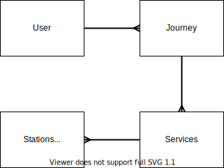

# Analysis

## Investigation
### Introduction to Client
Mr Kevin Ashley is the managing director of Ashley Quality Improvement Services, a company that provides consultancy services for drug manufacture in the pharmaceutical industry. His role involves frequent travel around the UK and the EU, with schedules often changing to suit client needs. As such, he makes frequent use of public transport methods such as air and rail travel. However, during this travel he is often disrupted due to delays (particularly in the UK) - and as such has asked myself to attempt a program that would be able to dynamically reroute his journey as a result of delays.

### Outline of the Problem
When travelling by train in the UK, Mr Ashley's journeys often involve at least one connection between services. However, disruption on the rail network can result in him missing his connection, and having to wait at a connecting station. Due to the nature of his work and lack of facilities at train stations, a missed connection typically results in a disruption to his workflow; potentially reducing billable hours. Furthermore, due to the complex nature of his journeys, a missed connection early in the journey typically results in having to find alternative connections later in the journey - causing greater disruption to his workflow. 

For example, Mr Ashley regularly travels from his home station of Ulverston to Chester to visit a client. This journey involves a minimum of two changes; from the Ulverston train to the West Coast Main Line (WCML), then from the WCML to Chester. There are various routings available from the WCML to Chester - via Warrington, and via Crewe. The earliest arrival time on this route depends on available trains in the timetable. As such, a missed connection onto a WCML service can mean a routing that was originally quicker via Crewe is quicker via Warrington - however, this is harder to identify during a journey without recalculating the entire route again manually.

Furthermore, recalculating the route manually typically does not take into account factors such as connection times from one service to another. In the case of the Warrington/Crewe problem, a train running 15 minutes late at Warrington is highly likely to miss the connection onto the service to Chester at Crewe - therefore, it is highly likely that changing at Warrington would achieve the quickest overall journey time. However, this is difficult to work out manually during delays and as such he would prefer for this process to be automated.

Therefore, Mr Ashley is seeking a solution that informs him of any disruption to his journey in real time; and if the disruption is so great as to cause a missed connection, recalculate his route based on the fastest possible routing.

### Interview with Client
**How do you travel normally in the UK?**   
I use the Trainline app to book my tickets prior to commencing my journey. Then during my journey, I use station departure boards and the Trainline app to check if there has been any disruption to my journey. When I am aware of any significant disruption to my journey, such as a late arrival time, I use the Trainline app again to determine if I need to change my journey. However, this is particularly difficult to do when travelling as there may be poor loading times or my journey may need to change further. This is much worse than the solution I use for travel in the Netherlands, where the NS (Dutch Railways) app automatically informs me of any disruption and quickly informs me of my available options, including alternate routes.

**What benefits does your current system have?**  
The current system is particularly useful during the initial planning of a journey, checking my available options. It is also useful in terms of providing some information about disruption that may impact my journey, such as engineering works or a broad description of disruption. My current system has also adopted well to the COVID-19 crisis - which has resulted in a more contactless railway and frequent timetable changes. The availability of mobile tickets is particularly useful for me.

**What are the drawbacks of your current system?**  
While the apps I currently use are good in terms of informing me about general disruption, they aren't as good at telling me when my journey has been impacted. This means that when I am impacted by disruption, I have to manually check my alternate options. The nature of a delayed journey means that I often have to spend more time worrying about issues such as contacting clients about my late arrival and is generally disruptive to my workflow. Furthermore, the current system is somewhat difficult to use when claiming my money back through Delay Repay.

**Are there any particular features you feel are essential to a new system (must haves)?**  
The most important thing for me is having a solution that is able to remove the majority of the manual work that is required when re-routing a journey. Ideally, I would like a solution that notifies me in real-time if there is any disruption to my journey, before providing me with alternative options. I should then be able to choose from these options before being navigated on the new journey. It would also be good to have information about stations that aren't on my route - particularly during circumstances that involve tight connections.

I will provide you with an example journey after the meeting to show you what I mean about alternative options - ideally, they should not just be those available through normal journey planners but give me tight connections as options too.

**Are there any features that you feel would improve the system but do not require? (nice to haves)**   
As I mentioned before, I often spend a disproportinate amount of time having to claim back tickets through Delay Repay schemes. It would be beneficial if it was able to provide the information necessary for a Delay Repay claim, and if possible make the claim automatically. It would also be useful if the app was able to inform others about the progress of my journey if needed - for example, if I was visiting a client and would be at least 15 minutes late then it would be good if the client could be emailed about this, or even informed through the app itself.

Another potentially useful feature is information about quicker methods than rail - for example, it can be quicker to take the bus if a train to Barrow is cancelled. I do appreciate that this may involve much greater complexity - but it would certainly be nice to have!

**How would you envisage using this new system? (web app / mobile app?)** 
Ideally, either an app or through a webpage. There definitely should be notifications on my phone about any changes to the journey. 

**Do you envisage a need to connect this system with other corporate services?**  
I use Google Workspace for managing my email services. If you were able to integrate the emailing of clients that I discussed earlier, it would be good if this was done directly through my work account. I'd also appreciate it if the app was able to automatically create a calendar appointment when I input my journey. 

**Is there anything else you would like to add?**   
I would highly recommend that you look at the NS app that I mentioned before - it pretty much shows the majority of what I'd want to see in your final solution.

### Current System
Currently, Mr Ashley books his journeys on the 'Trainline' app prior to the journey - but typically does not have time to check the status of his journey. As such, delays are often realised upon arriving at the station or during the journey. If the delay is sufficient enough to cause a missed connection, many of his journeys have the potential to have quicker arrival at the destination via a different routing - meaning that he often replans his whole journey from that point. However, when involved in disruption, this does not always enable him to achieve the earliest arrival at his destination due to the real time nature of delays.

## Analysis of Investigation

### Interview Analysis
The interview has provided me with several useful points of information that will contribute greatly in developing a proposed solution. There are a lot of features that could be implemented to improve the experience of the application that we discussed; however, it is clear that the main focus of the program will be on dynamic journey planning. I also intend to work on some form of Delay Repay information system to help the client, and integration with the client's Google Workspace setup.

// Talk about NS app features - what is attainable.

// Talk about Delay Repay - automatic not possible, but information is possible

// Talk about OAuth integration, emails and calendar appointments.

### Analysis of Example Journey
Following the interview, Mr Ashley has kindly provided me with an example of his typical journey from Ulverston to Chester. This is illustrated in the diagram below:

On a typical journey, Mr Ashley travels on the 17:04 to Preston, before changing at Preston for the 18:17 to Crewe. He then waits for 27 minutes at Crewe for the 19:24 service to Chester. This is the journey that Mr Ashley is given in the Trainline app when booking prior to the journey; it does not account for any potential disruption. During our initial interview, Mr Ashley highlighted this journey as being one which is often disrupted.

This journey also highlights some of the complications involved in journey planning in the UK. While ultimately dictated by available services, a factor that is introduced on journeys involving connections is that of the Minimum Connection Time (MCT). This time is a reasonable amount of time for a person travelling to make a change between services, even at a station they are unfamiliar with. It should be noted that the minimum connection time is **not** the minimum time actually required to change between two services, but rather a figure for journey planning purposes. As such, while it is a reasonable assumption to make that when a connection is below the MCT that a new route may be needed, a tight/unofficial connection can often still be made.

Following been given this example, I have also found the timetable data for the period following the 1704 departure from Ulverston. This can be found in **Appendix I**.

#### Example 1: Disruption to first journey
*Mr Ashley boards the 17:04 service from Ulverston, which departs on time. However, prior to arriving at Preston, the train encounters cows on the line – causing a 9 minute delay. The train arrives into Preston at 18:15 – below the minimum connection time of 8 minutes.*

In this example, there is still the possibility of Mr Ashley being able to connect onto the 18:17 service that he originally intended to travel on. However, the connection is extremely short, so for the purposes of this example, we shall assume that he missed it and needs to find a new routing. These potential routings are highlighted in the diagram below.

There are three viable reroutes for this journey - one following the original routing via Crewe, and two via Warrington Bank Quay.

The first rerouting, via Crewe, is the most obvious. It would involve joining the next service to Crewe, then the next service to Chester. This journey is indeed the one that many people would follow in this situation, but is in fact the longest; causing a 60 minute delay, and a longer wait at Preston.

The other two reroutes involve changing at Warrington Bank Quay (WBQ) - with the difference between the routings being the connection time at WBQ. In the case of the second option, there is a four minute connection time at WBQ. This is below the MCT for the station of 5 minutes - and as such, is not classified as an official journey option and would not be displayed on normal journey planners. However, this does not take into account the cross platform nature of the interchange - and as such, this reroute, while being an unofficial connection, is in fact a viable option. In the case of further disruption, however, it is highly likely that there may be a missed connection.

The third option is more resillient, with a 17 minute connection time at WBQ - above the minimum five minutes, which in turn provides more time in case of further disruption.

As such, it is logical to plan for the second option but be prepared to take the third. However, there are a few key points we can take from our analysis of this scenario:
* **The most obvious routing is often not the quickest.** In the case of this sample, we deliver a maximum delay (assuming no significant further disruption) of 16 minutes routing via WBQ, and can deliver an 8 minute maximum delay if there is no disruption from Preston.
* **The most efficient routings aren't always obvious.** The quickest routing, with a delay of 8 minutes, would not be displayed using a journey planner due to the unofficial connection at WBQ. This shows that while journey planners are good for initial planning, the usage of baseline MCTs can actually cause further delay as users aren't informed of potential quicker options.

#### Example 2: Disruption while enroute
*Mr Ashley boards the 17:04 service from Ulverston, which arrives at Preston as scheduled. He then boards the 18:17 service to Crewe as scheduled. At Wigan North Western, police are called due to a disturbance in the shop. This causes a 23 minute delay to the service, resulting in an estimated arrival time into Crewe of 19:20.*

In this example, there is again still the potential to follow the originally intended routing and arrive at Chester as scheduled. However, Crewe is a large station, and has a 10 minute MCT. As such, it is reasonable to assume that the connection is potentially not possible, especially when unfamiliar with the station - which is shown in the diagram below.

*Diagram copyright National Rail Enquiries - used under fair use.*

The diagram above also includes the routing from Platform 5 to Platform 9, the timetabled platforms for these two services. It is at this point where it is important to make the distinction between a connection which is 'potentially not possible' and 'impossible'. While 4 minutes is a very tight connection at a large station like Crewe, for an experienced traveller it may still be very possible.
Indeed, speaking to Mr Ashley, he estimates his standard connection time at Crewe is about 5 minutes anyway. It is also possible possible to make the connection process quicker through forward planning - for example, knowing which doors to leave the train at to access the bridge quickly.

Considering these factors, two potential options become apparent following the delay at Wigan:
- **Continue to Crewe:** while a tight connection, still potentially possible. Joining the original service would be most likely to allow an on time arrival. However, the tight nature of the connection may not be suited for an inexperienced traveller.
- **Leave the train at WBQ:** This would ensure that an official connection would be possible (to the 19:26 service mentioned in Example 1) - however, potentially causing an unneccessary 8 minutes of delay.      

The decision to change services is hardly clear cut, and depends on many factors and a lot of 'what if?' scenarios. The service to Crewe may make up time before arriving, allowing a more relaxed connection - equally, there is the chance that the service may be delayed further. It may also be difficult for a passenger travelling to find out information about available services from Warrington in time.

It is in this situation that having data accessible to determine the likelihood of further delay, or less delay, would be helpful. Equally, having the journey options available at WBQ would also be beneficial. These are both issues that the system proposed would be able to assist with - looking at past performance data of the services involved, and being able to display information to the user to help make an informed decision.

We can therefore take the following points from our analysis of this journey:
* **Making a decision during disruption is not clear cut.** It is difficult to make a decision that is not simply 'chancing' it while travelling - it is near impossible to check past performance data on the move, while finding alternative journey options while travelling may also be difficult.
* **Human factors play a major role.** Someone who is inexperienced at travelling may find a tight connection much more difficult than an experienced traveller who commutes on a route weekly. As such, it is difficult for a system to accurately determine the probability in situations such as this example.

#### Conclusion
Overall, looking into the example journey and the different circumstances that can impact it have given me both ideas for the solution while also presenting some problems, most notably when involving tight connections where the users actions are the biggest influence. Before starting the design of the program, I will research minimum connection times further to see what assumptions I can reasonably make, and which ones are more nuanced and require direct user intervention.

### Further research

### Entity Relationship Diagram
    
User represents the end-user using the program. One user can have many journeys using the application, having a one-to-many relationship. Each journey using the application will have at least one service, and due to the nature of the application will likely involve many services - again giving a one to many relationship. Each service will call at multiple stations, which will be treated by the application as a data point to determine disruption. This is also representative of a one-to-many relationship.

### Data Flow Overview
**Input:**

**Process:**

**Output:**

**Storage:**

### Data Flow   
To help me visualise the flow of data within the system, I have created a series of data flow diagrams (DFD). This will also help me identify areas that could be optimised.

**Current System - Level 0**   

The current system is relatively simple. The checking of journey progress is typically done through the Trainline mobile app, as is 'Find Routing'. I do not envisage the program becoming more complex for the user at the point of use - however, there will be additional functionality added to reduce the need for the user to request data.

I have determined there is no need for a Level 1 DFD for the current system as I am unable to accurately determine the data flow to that level.

**Proposed Solution - Level 0**

**Proposed Solution - Level 1**

## Proposed Solution

### Data Dictionary
**User Information**
| Field            | Data Type | Example                                                            | Validation                                                                                                        |
|------------------|-----------|--------------------------------------------------------------------|-------------------------------------------------------------------------------------------------------------------|
| Username         | CHAR(20)  | "agentsquash"                                                      | Username should be less than 20 characters; Username should be alphanumeric;                                      |
| isOAuth          | BOOLEAN   | FALSE                                                              | If user is authenticating via Google; should be TRUE. If user is using an app specific account - should be FALSE. |
| Password         | CHAR(64)  | "9e66a118b9a0fb8cada5eb0f357806a21cc067fa4b9d9f76eb9773a24e022438" | Password should be 64 characters long. Passwords are hashed and salted.                                                                           |
| OAuthAccessToken | CHAR(256) |                                                                    null|                                                                                                                   |
| Email            | CHAR(320) | "john.appleseed@icloud.com"                                                  | See https://tools.ietf.org/html/rfc3696#section-3                                                                 |
| Admin            | BOOLEAN   | TRUE                                                               | TRUE = Grant admin rights. FALSE = Normal user.                                                                   |

This table will be used to store end user login information. There will be a class which encapsulates all authentication behaviours and interfaces with the website. The class will contain OAuth integration to allow users to use their Google account to login instead of directly creating an account on the system. Alternatively, users can create an account by providing a username, password (which will be hashed and has a salt) and email address. This table also handles User Access Levels - where an admin user is able to access usage statistics for all users (anonymised) while user access grants users only access to their data.

**Journey**
| Field             | Datatype | Example                | Validation                                                                                                                     |
|-------------------|----------|------------------------|--------------------------------------------------------------------------------------------------------------------------------|
| departureCRS      | CHAR(3)  | "ULV"                  | Must be valid National Rail routing point. When a station name is entered, it will be converted using the National Rail API.   |
| arrivalCRS        | CHAR(3)  | "CTR"                  | Must be a valid National Rail routing point. When a station name is entered, it will be converted using the National Rail API. |
| planDepTime       | DateTime | 04/12/2002 04:38:00 PM | Time should be in the future when creating a journey.                                                                          |
| actDepTime        | DateTime | 04/12/2002 04:39:00 PM | Time should be in past when entered.                                                                                           |
| planArrTime       | DateTime | 04/12/2002 05:38:00 PM | Time should be in the future when creating a journey.                                                                          |
| actArrTime        | DateTime | 04/12/2002 06:39:00 PM | Time should be in past when entered.                                                                                           |
| delayRepayEligble | BOOLEAN  | TRUE                   | If actArrTime >= planArrTime+15, then True                                                                                     |
| delayRepayBand    | INT      | 2                      | Check that band is equal to delay incurred.                                                                                    |
| delayRepayTOC     | CHAR(2)  | "VT"                   | Company that caused the delay.                                                                                                 |
| service_1(-10)    | VARCHAR(36)  | _I-TViCwPv8uNOTk-oNeJQ | Service name is the same as the web-safe Darwin GUID.                                                                          |

This class contains the journey information that will be stored locally by the system. It is used in the creation of new journeys within the system, and will also be used to determine whether a journey is eligble for Delay Repay. The class also the unique service identifier as provided by the National Rail Darwin API to allow the identification of unique services by the application. The information contained within the Journey class will be stored long term by the system to provide journey history.

**Progress Class**      
The Progress Class is created dynamically by the application when a journey is in progress. It consists of the following data:
| Field          | DataType    | Example                | Validation                                                               |
|----------------|-------------|------------------------|--------------------------------------------------------------------------|
| service_guid   | VARCHAR(36) | _I-TViCwPv8uNOTk-oNeJQ | The Darwin GUID of the current service. Set to NULL if connection = TRUE |
| connection     | BOOLEAN     | FALSE                  | Set to TRUE if a connection is in progress.                              |
| nextCRS        | CHAR(3)     | "BIF"                  | Must be a valid National Rail routing point.                             |
| nextTimetable  | DateTime    | 04/12/2002 05:38:00 PM | Matches a timetable entry for the CRS                                    |
| nextETA        | DateTime    | 04/12/2002 05:42:00 PM | Matches the Darwin feed ETA.                                             |
| lastCRS        | CHAR(3)     | "ROO"                  | Must be a valid National Rail routing point.                             |
| lastTimetable  | DateTime    | 04/12/2002 05:32:00 PM | Matches a timetable entry for the CRS                                    |
| lastETA        | DateTime    | 04/12/2002 05:36:00 PM | Matches the Darwin feed actual arrival.                                  |
| currentDelay   | INT         | 5                      | Difference between nextTimetable and nextETA                             |
| intervene      | BOOLEAN     | TRUE                   | If currentDelay is below MCT, then TRUE                                  |
| interveneLevel | INT         | 2                      | Defined in Design.                                                       |

The Progress Class handles the real time disruption handling part of the system. It tracks the progress of the current journey against the planned routing, and determines whether there is a need to intervene, and the level of intervention (notification) required. At this stage in development, there are provisionally four Intervention Levels.

* -1: No intervention required.
* 0: Unofficial/tight connection. No rerouting deemed necessary.
* 1: Unofficial/tight connection. Information about rerouting/connection available to user.
* 2: Missed connection. Journey options shown to user.

The class will contain algorithms that respond to the intervention level and provide the necessary information for the end user.

### Data Volumes
I intend to provide the solution as a website for the end-user, necessitating minimal storage space for the end user.

At the server side, most information is not stored locally but rather fetched as necessary from the National Rail/TFL APIs. 

### Acceptable Limitations
Unfortunately, it is unviable to obtain access to the National Rail Journey Planning system due to cost. This means that the journey planning solution will have to be manually maintained, and as such may lack fully up to date information on all stations on the National Rail network, such as changed MCTs and new alternative routings. Furthermore, due to time constraints, my solution will only have limited integration with other forms of public transport which may be more viable options (such as taking a bus). 
The system will also be unable to determine whether the users ticket is valid for the routing taken, as it is not possible to fully integrate ticketing restrictions within the time frame of the project. However, due to the focus of the solution largely being on finding new journeys during disruption (where ticket restrictions are typically relaxed following missing the original service) this issue in particular should have minimal impact on the usability of the solution.
// Not here? // Mr Ashley has also stated that while he would like to see the implementation of automatic delay repay within the solution, it would be acceptable if the application only provided the information necessary for the claim. Further research into this has highlighted the unsuitability of many TOCs web services for automatic solution-based claims - typically requiring registration. The introduction of this feature would also require the storage of payment information, which would introduce new complexity to the solution.

## Objectives
