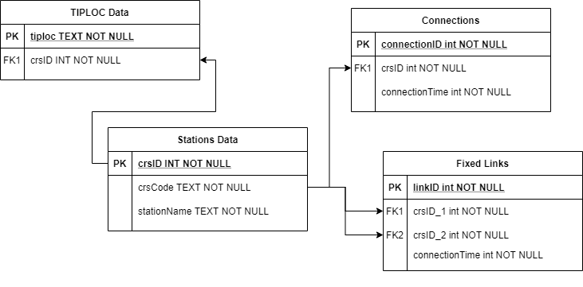

# Design
## Introduction
The client has expressed the need for a system that fundamentally completes three tasks:
- detects when a booked journey is delayed
- flags that disruption to the user
- offers reccomendations to resolve the disruption

The application will need to complete other utility tasks, such as handling user authentication and storing journeys. As a result, I have first started the development of my proposed solution by designing a flow chart that fulfills the clients requirements, as well as going some way to implement additional requested features.

 // Does this fit better in here than analysis?

From this flow chart and the fundamental tasks described previously, I have been able to identify four main parts to the implementation of the client's solution:
- Data Fetcher: collects the data necessary for the operation of the program
- Journey Planner: finds new routings in the case of disruption for the user
- Disruption Handler: Checks for disruption and then handles accordingly (interfacing with the Data Fetcher and Journey Planner as necessary)
- Journey Class: handles the journey itself, and contains a Disruption Handler.

This can be seen in the class diagram below:

// Will add in structual diagram for classes shortly. Journey contains a Disruption Handler and Data Fetcher. Disruption Handler can make use of the Journey's data handler and also contains a Journey Planner.

#### Coded Journey
The National Rail timetable is subject to much variation on a daily basis. As such, for all parts of the program that do not involve the handling of realtime data, a coded journey will be used for testing purposes. This coded journey is from Ulverston (ULV) to Chester (CTR), and mimics the example journey provided to myself by Mr Ashley. 

### Design: Data Fetcher

**DataFetcher**
// Trying to figure out how to best deal with class diagrams on Markdown. Will discuss this with you on Monday.


## Journey Planner

## File Structure

## Database Design
There are various aspects of my solution that require data to be stored, and as such the usage of a database. These include:
- Storing user data to enable login and journey storage.
- Storing station + connection data for journey planning purposes
- Storing planned journey information to enable advance planning.

### Table Designs
In my solution, there are various pieces of data that need to be stored, which are not directly linked. As such, I will use multiple tables stored in a central SQLite database, 'data.db', in my solution. These tables, and their creation statements, are detailed below.

#### Stations Data
This table stores data that needs to be held long term by the program, and uses the data provided by the UK Government's National Public Transport Access Node (NaPTAN).

Due to the large amount of stations in the UK, only essential information is stored by the Stations Data database. Passenger facing information, including station operator and available facilities, is fetched directly from the National Rail Knowledgebase. This results in an initial create table statement of:
```
CREATE TABLE IF NOT EXISTS stationdata (
	tiplocCode VARCHAR(7) UNIQUE, 
	crsCode VARCHAR(3), 
	stationName VARCHAR(64), 
	connTime INT
)
```
- TIPLOC code: This is the internal code used in the National Rail Timetable.
- CRS (3Alpha) code: This code is the publically facing station code. This data is stored locally for performance reasons when initially searching for stations.
- Station Name: the name of station.
- Connection Time: The minimum connection time at the station (see Connection Time below)

However, in its current form, the data is not compliant with 1st Normal Form. Data is duplicated within the same table (for example, multiple CRS codes which share the same station name) and the primary key is not identified. To resolve this, I firstly modelled the data that is needed in the database using an Entity Relationship Diagram.



From this relationship diagram, I have identified a need for four unique tables to allow normalisation of the data. The create table statements for these are shown below:
```
CREATE TABLE IF NOT EXISTS stations_data (
	crsID INTEGER UNIQUE,
	crsCode TEXT UNIQUE,
	stationName TEXT,
	PRIMARY KEY(crsID AUTOINCREMENT)
)
```
```
CREATE TABLE IF NOT EXISTS tiploc_data (
	crsID INTEGER
	tiploc TEXT UNIQUE
	PRIMARY KEY(tiploc)
)
```
```
CREATE TABLE IF NOT EXISTS connections (
	connectionID INTEGER UNIQUE
	crsID INTEGER
	connectionTime INTEGER
	PRIMARY KEY(connectionID AUTOINCREMENT)
)
```
```
CREATE TABLE IF NOT EXISTS fixed_links (
	linkID INTEGER
	crsID_start INTEGER
	crsID_end INTEGER
	connectionTime INTEGER


***Connection Time***			

National Rail does not make available minimum connection time data in an easy to use format for development purposes. As such, this data must be entered in manually. 

However, some stations also have designated 'fixed links' - connection times between other stations. These fixed links also vary in length, depending on time of day. As an example:

**London Blackfriars to London Waterloo**
| Mode     | Between   | Time       |
|----------|-----------|------------|
| Transfer | 0001-0659 | 28 minutes |
| Tube     | 0700-2359 | 23 minutes |

This table shows that between 0001 and 0659, the standard 'fixed link' between Blackfriars and Waterloo is 28 minutes. This reduces to 23 minutes by Tube between 0700-2359. For the purposes of this project, the highest value will be used for the fixed link database.

In recent years, stations in what is known as the Thameslink Core (Blackfriars-St Pancras) have introduced an operator specific connection time for Thameslink services of 3 minutes. As this is such a niche use case and considering development time constraints, I will not be implementing this - instead using the highest connection time value in the generic data.

The generic service-to-service connection time will be handled by the 'connections' table, while to prevent unnecessary null fields I have separated out the fixed links to another table. This ensures minimal repetition, and minimises redundant data also.
### SQL Queries

### Entity Relationship Diagram

## Interface Design

## Test Plan


High level overview of your system and how different parts interact.
	• Structure / hierarchy chart
	• System flowchart
	• Object / class diagrams with additional explanation

Document how parts of your system work.
	1. Choose 6-7 algorithms in your code and design them in pseudocode/flowcharts explaining how they fit into your solution.
	2. Clear and annotated user interface designs.
	3. Data structures.
	4. File structure and organisation.
	5. Database design (CREATE TABLE statements) and queries (they need explaining and examples providing).
	
Initial focus needs to be on how to handle the data provided by the National Rail APIs and how to consume them - offline first.
